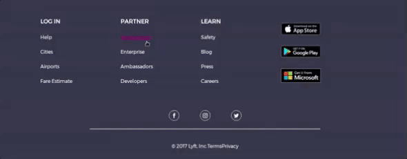

# Lyft

* **Unidad:** _Maquetado web con HTML & CSS_

***

Para completar este reto, hemos creado un repositorio Lyft con todos los recursos que necesitas. Esto incluye imágenes y
estructura de carpetas y archivos donde colocarás tu código.

## Flujo de trabajo

1. Empezamos con la estructura del proyecto enlazando los archivos css,la pafina de fontawesome donde obtendremos los iconos y para los tipos de letra con:
[Font Awesome](http://fontawesome.io/).
[Font google](https://fonts.google.com/?query=mon&selection.family=Montserrat)

2. Realizamos el maquetado del html en `index.html` ,donde colocaremos los diferentes **section** que contendra  nuestra pagina.
  `header`
  `second`
  `videos`
  `footer`

3.  En la section `header` aplicamos las clases y tendremos las etiquetas como:
 - `menu`, `inline`.

4. En la section `first` Utilizaremos:
 - `h6` ,`h1` ,`input` y `button`.

5. En la section `second` utilizamos el div del texto y la etiqueta `img`.

6. En la section `videos`utilizaremos las etiquetas `iframe`.
- Estos son los videos a utilizar:
  * https://www.youtube.com/watch?v=fLSmUWOYpKw
  * https://www.youtube.com/watch?v=V7j8Aqxmbs8
  * https://www.youtube.com/watch?v=xj2VWLV0xCU

7. En la section `footer` utilizamos los iconos de **font awesome** y daremos un hover a las listas para que se muestre asi:

   

7. luego añadimos los estilos al `main.css`,con los diferentes selectores de las clases,ID's.

8. Utilizaremos la tipografía `Montserrat`.

## Objetivo

Este será el resultado que podras visualizar:

